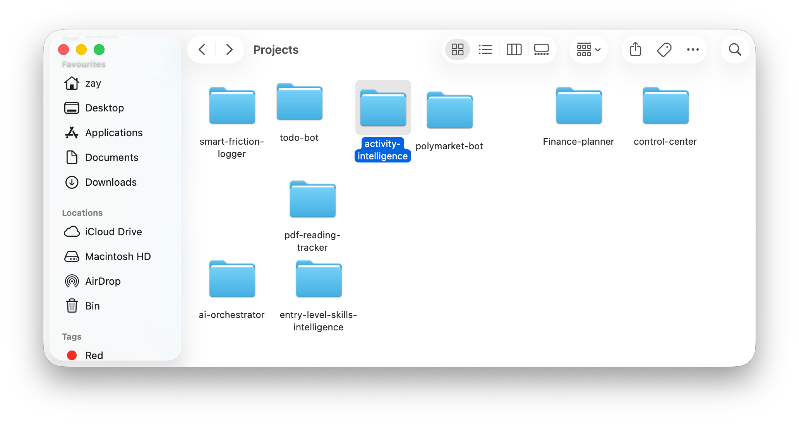

# Control Center

A personal OS dashboard for macOS — live activity tracking, focused work, reminders, and an AI command bar, all in one place.



---

## What it is

Control Center is the evolution of [activity-intelligence](https://github.com/zayzyyazy/activity-intelligence) — taken from a scripts-and-data project into a full native desktop app.

It surfaces everything you need to stay oriented throughout the day: what you're working on, what's pending, how you've been spending your time, and an AI command bar you can type anything into.

Everything runs locally. No cloud sync, no accounts, no telemetry. It connects to your file system, a SQLite database, and ActivityWatch.

---

## Features

| Area | What it does |
|---|---|
| **Now** | Live strip showing the app you're currently in, updated every 7s |
| **Today / Focus** | Pending reminders ordered by priority — click to open the project folder |
| **Working On** | Auto-detected recently modified projects with open / file / focus actions |
| **Activity** | Top apps by time today, pulled live from ActivityWatch |
| **Projects** | Count of finished software and research projects, clickable to source files |
| **Ideas** | Most recent captured ideas from your notes, clickable to open the file |
| **AI Command Bar** | Natural language input — add reminders, capture ideas, set focus, summarize your day |

---

## AI Command Bar

Type anything in plain English and press Enter:

```
remind me to clean the desktop
```
> "Clean the desktop" added to reminders.

```
what should I do today?
```
> 2 pending reminders: fix the export bug, review PR. Top app today: Xcode (47m).

```
idea: build a pomodoro timer for the menubar
```
> Idea saved to software notes.

```
I finished planning finances and calling the dentist
```
> Matched 2 reminders. Marked done: "Plan finances", "Call dentist".

---

## Tech stack

- [Tauri v2](https://tauri.app) — Rust backend + native macOS shell
- [React 18](https://react.dev) + TypeScript — UI
- [Vite](https://vitejs.dev) — dev server and bundler
- [SQLite via rusqlite](https://github.com/rusqlite/rusqlite) — reminders and activity log
- [ActivityWatch](https://activitywatch.net) — local app usage tracking
- [OpenAI API (GPT-4o-mini)](https://platform.openai.com) — command intent classification

---

## Setup

```bash
git clone https://github.com/zayzyyazy/fullOS-controlcenter.git
cd fullOS-controlcenter
npm install
```

Set your OpenAI API key:

```bash
export OPENAI_API_KEY=sk-...
```

> The key is read at runtime by the Rust backend and is never written to disk or committed to the repo. The AI command bar won't work without it, but the rest of the dashboard will.

Run in dev mode:

```bash
npm run tauri dev
```

Build a release `.app`:

```bash
npm run tauri build
```

The `.app` will be at `src-tauri/target/release/bundle/macos/`.

---

## Configuration

Before running, update the hardcoded paths in `src-tauri/src/lib.rs` to match your machine:

```rust
const DB_PATH: &str = "/your/path/to/activity.db";
const FOCUS_FILE: &str = "/your/path/to/focus.json";
const SW_FINISHED: &str = "/your/path/to/finishedprojects.txt";
```

A config file approach is on the roadmap.

---

## Requirements

- macOS (arm64 or x86_64)
- [ActivityWatch](https://activitywatch.net) running on port 5600
- [Rust + Cargo](https://rustup.rs)
- Node.js 18+
- OpenAI API key

ActivityWatch must be running for the Now strip and Activity card to show live data. The rest of the dashboard works without it.

---

## Roadmap

This is v1. Currently building out:

- [ ] **Idea recommendations** — suggest what to work on based on your current pace and patterns
- [ ] **Auto activity sync** — automatic syncing without manual log commands
- [ ] **Expanded AI intelligence** — more context-aware responses and richer daily insights
- [ ] Config file for paths (no more hardcoded constants)
- [ ] Global quick-capture hotkey
- [ ] Richer activity breakdown (hourly chart)
- [ ] Weekly summary / export
- [ ] Notifications for overdue reminders

---

## Notes

- `focus.json` is local runtime state and is gitignored. It's created automatically the first time you set focus.
- `src-tauri/target/` is gitignored. The first build takes a few minutes as Cargo compiles dependencies.
- All data stays on your machine. The only outbound network call is to OpenAI when you use the command bar.
