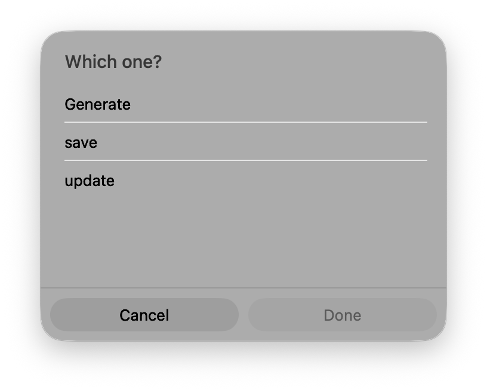
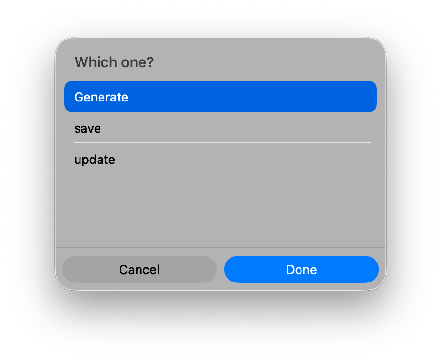

# Control Center

A personal OS dashboard built for macOS — live activity, focused work, reminders, and an AI command bar, all in one dark window.


---

## What it is

Control Center is a local-first desktop app that surfaces everything you need to stay oriented throughout the day: what you're working on, what's pending, how you've been spending time, and an AI command bar you can type anything into.

It connects to your local file system, a SQLite database, and ActivityWatch — no cloud sync, no accounts, no telemetry.

---

## Features

| Area | What it does |
|---|---|
| **Now** | Live strip showing the app you're in right now, updated every 7s |
| **Today / Focus** | Pending reminders ordered by priority. Click the focus block to open the project folder |
| **Working On** | Auto-detected recently modified project folders with open / file / focus actions |
| **Activity** | Top 3 apps by time today, pulled live from ActivityWatch |
| **Projects** | Count of finished software and research projects, clickable to open the source files |
| **Ideas** | Most recent captured ideas from your notes, clickable to open the file |
| **AI Command Bar** | Natural language input — add reminders, capture ideas, set focus, summarize your day |

---

## Screenshots

**Main dashboard**


**Focus and Working On**


**Command bar**


---

## AI Command Bar — example inputs

The command bar accepts plain English. Examples:

```
remind me to clean the desktop
```
> "Clean the desktop" added to reminders.

```
what should I do today?
```
> 2 pending reminders: fix the export bug, review PR. Top app today: Xcode (47m).

```
idea: build a pomodoro timer for the menubar
```
> Idea saved to software notes.

```
focus on control center
```
> Focus set to control-center.

```
I finished planning finances and calling the dentist
```
> Matched 2 reminders. Marked done: "Plan finances", "Call dentist".

```
I spent the last hour on research
```
> Logged: research.

---

## Architecture

```
src/                    React frontend (Vite + TypeScript)
  pages/Home.tsx        Single-page dashboard — all UI lives here

src-tauri/src/lib.rs    Rust backend — all Tauri commands
  get_dashboard_data    Reads DB + file system + ActivityWatch
  process_command       Classifies and routes AI input via OpenAI
  open_path             Opens a file or folder in the system default app
  add_reminder          Inserts into SQLite
  mark_reminder_done    Updates SQLite
  set_focus             Writes focus.json
```

Data flows:

- **Dashboard**: frontend polls `get_dashboard_data` every 7 seconds (silent refresh), and also on window focus and tab visibility change.
- **Commands**: frontend sends raw text → Rust calls GPT-4o-mini to classify intent → executes locally → refreshes dashboard.
- **Activity**: Rust calls ActivityWatch REST API on `localhost:5600` directly, no intermediary.

---

## Tech stack

- [Tauri v2](https://tauri.app) — Rust backend + native macOS shell
- [React 18](https://react.dev) + TypeScript — UI
- [Vite](https://vitejs.dev) — dev server and bundler
- [SQLite via rusqlite](https://github.com/rusqlite/rusqlite) — reminders and activity log
- [ActivityWatch](https://activitywatch.net) — local app usage tracking
- [OpenAI API (GPT-4o-mini)](https://platform.openai.com) — command intent classification
- No CSS framework — all styles are inline React style objects

---

## How it works

### Dashboard refresh
The frontend calls `invoke("get_dashboard_data")` on mount, then silently re-calls it every 7 seconds and on window focus. The Rust handler:
1. Reads pending reminders from SQLite
2. Calls ActivityWatch at `localhost:5600` for today's events and the most recent window event
3. Scans configured project root folders for recently modified directories
4. Reads focus state from `focus.json`
5. Reads project count and idea files from disk

### AI command bar
1. You type anything and press Enter
2. Rust sends the text to GPT-4o-mini with a strict intent classification prompt
3. Response maps to one of: `add_reminder`, `complete_from_summary`, `log_activity`, `capture_idea`, `set_focus`, `suggest_today`, `refresh`, or falls back to a freeform answer
4. The matched intent executes a local side effect and triggers a dashboard refresh

### Working On detection
Rust scans three root directories (Projects, Software & Tools, Research & Writing), reads the most-recently-modified file in each subdirectory, and ranks by recency. Shown as clickable cards.

---

## Requirements

- macOS (arm64 or x86_64)
- [ActivityWatch](https://activitywatch.net) running locally on port 5600
- [Rust + Cargo](https://rustup.rs)
- Node.js 18+
- An OpenAI API key (for the AI command bar)

ActivityWatch must be running for the Now strip and Activity card to show data. The rest of the dashboard works without it.

---

## Setup

```bash
git clone https://github.com/your-username/control-center.git
cd control-center
npm install
```

Set your OpenAI API key in your environment:

```bash
export OPENAI_API_KEY=sk-...
```

> The key is read at runtime by the Rust backend via `std::env::var("OPENAI_API_KEY")`. It is never written to disk or committed to the repo. The AI command bar will return an error if the key is not set, but the rest of the dashboard works without it.

Run in dev mode:

```bash
npm run tauri dev
```

Build a release `.app`:

```bash
npm run tauri build
```

The `.app` bundle will be at `src-tauri/target/release/bundle/macos/`.

---

## Configuration

The app currently reads from hardcoded paths in `src-tauri/src/lib.rs`. Before running, update these constants to match your setup:

```rust
const DB_PATH: &str = "/your/path/to/activity.db";
const FOCUS_FILE: &str = "/your/path/to/focus.json";
const SW_FINISHED: &str = "/your/path/to/finishedprojects.txt";
// ...
```

A config file approach is on the roadmap.

---

## Roadmap

- [ ] Config file for paths (no more hardcoded constants)
- [ ] Editable focus — set or clear focus directly from the dashboard
- [ ] Streak / time-on-task display in the focus block
- [ ] Richer activity breakdown (hourly chart)
- [ ] Quick-capture hotkey (global shortcut, no need to open the window)
- [ ] Multiple idea categories in the Ideas card
- [ ] Export / weekly summary generation
- [ ] Notification on overdue reminders

---

## Notes

- `focus.json` is local runtime state and is gitignored. It is created automatically when you set focus for the first time.
- `src-tauri/target/` is gitignored. The first build will take a few minutes as Cargo downloads and compiles dependencies.
- All data stays on your machine. The only outbound network call is to the OpenAI API when you use the command bar.
